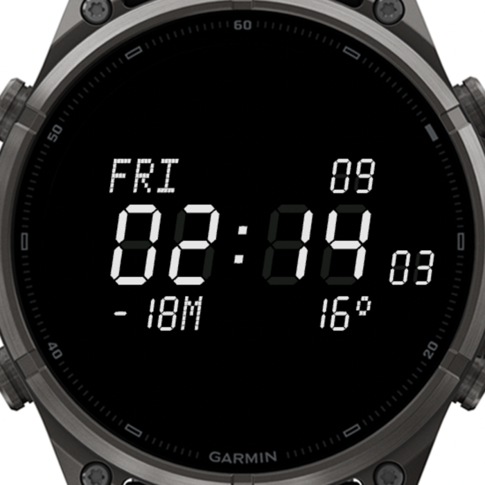
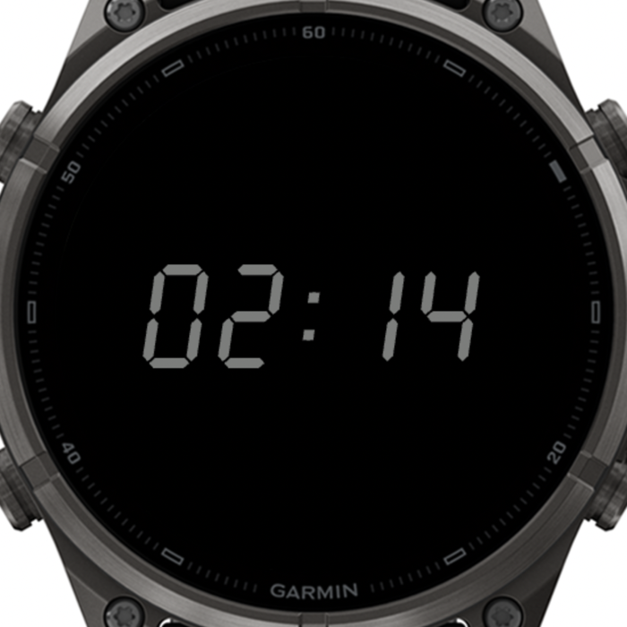

# Retro LCD — a battery-saving seven-segment watch face for Garmin

A minimalist retro digital watch face for Garmin AMOLED watches, written in Monkey C for Connect IQ.
It looks like a classic 80s quartz LCD module — slanted seven-segment digits, dot-matrix weekday,
faint "unlit" segments — and it is built around one goal: **use as little energy as possible**.

| Active | Always-on |
| :---: | :---: |
|  |  |

*Screenshots from the Connect IQ simulator (fēnix 9 Pro 47mm). The values are simulator data.*

## Why

On an AMOLED screen every lit pixel costs battery and a black pixel costs nothing. Most watch
faces fill the screen with rings, gauges and colour. This one does the opposite: a black screen,
a handful of thin segments, and only the five things I actually look at.

## What it shows

- **Time** in large seven-segment digits (12 h or 24 h, following the watch setting)
- **Seconds**, smaller, sitting on the baseline to the right of the time
- **Weekday** in dot-matrix letters and **day of the month**
- **Altitude**, in metres or feet following the watch setting
- **Temperature** from the current weather conditions, in °C or °F following the watch setting

Missing readings are shown as `---` / `--°` instead of crashing or showing stale data.

## How it saves energy

- **Black background.** Nothing is drawn that does not carry information.
- **Always-on display with only the time.** Seconds, date, altitude, temperature and the ghost
  segments are all dropped when the watch goes to sleep.
- **Dimmed always-on digits.** The same digits stay in exactly the same place, drawn at 55 % of the
  chosen colour, so nothing jumps when you raise your wrist.
- **About 4.5 % of the pixels lit in always-on mode**, measured on a simulator screenshot. Garmin's
  limit for AMOLED always-on screens is 10 %.
- **One redraw per minute while asleep.** No `onPartialUpdate`, no timers, no animations.
- **No sensor or weather reads while asleep.**
- **No background service and no permissions.**

## Settings

| Setting | Options | Default |
| --- | --- | --- |
| Digit color | White, LCD green, Amber, Red, Cyan | White |
| Show unlit segments | on / off | on |
| Show seconds | on / off | on |

Settings are edited from Garmin Connect / the Connect IQ app. Note that Garmin only exposes
settings for apps installed from the Connect IQ Store, not for side-loaded builds.

## Supported devices

Built and tested in the simulator for the **fēnix 9 Pro 47mm** (454 × 454 AMOLED). The layout is
computed from the screen size, so other round AMOLED watches should only need a new product entry
in `manifest.xml` and regenerated fonts (see below).

## Build

Requirements: the [Connect IQ SDK](https://developer.garmin.com/connect-iq/sdk/) with the device
files for your watch, Java, and a developer key at `~/.connectiq/developer_key.der`.

```bash
./build.sh            # debug build, bin/lcd.prg
./build.sh run        # debug build, then launch it in the Connect IQ simulator
./build.sh release    # release build for the watch, bin/RetroLCD.prg
```

## Install on the watch

1. Run `./build.sh release`.
2. Connect the watch over USB in MTP mode. On macOS you need an MTP client such as OpenMTP.
3. Copy `bin/RetroLCD.prg` into `GARMIN/APPS` on the watch.
4. Unplug, long-press the current watch face and select **Retro LCD**.

## Fonts

There are no third-party fonts. Every glyph — the seven-segment digits, the dot-matrix letters,
the degree sign and the launcher icon — is drawn by `tools/gen_assets.py` and packed into bitmap
fonts under `resources/fonts`. To regenerate them for another screen size:

```bash
pip install Pillow
python3 tools/gen_assets.py --screen 454
```

## Project layout

```
manifest.xml            app id, supported products
source/LcdApp.mc        application entry point
source/LcdView.mc       all drawing: active face and always-on display
resources/              strings, settings, generated fonts, launcher icon
tools/gen_assets.py     font and icon generator
```

## Known limitations

- The always-on time does not move. It has only been checked in the simulator, not for long-term
  burn-in behaviour on a real watch.
- Only one device is listed in the manifest.
- Weekday abbreviations are English only.

## Disclaimer

This is an independent hobby project. It is not affiliated with, endorsed by, or sponsored by
Garmin or any watch manufacturer. Garmin, fēnix and Connect IQ are trademarks of Garmin Ltd.
